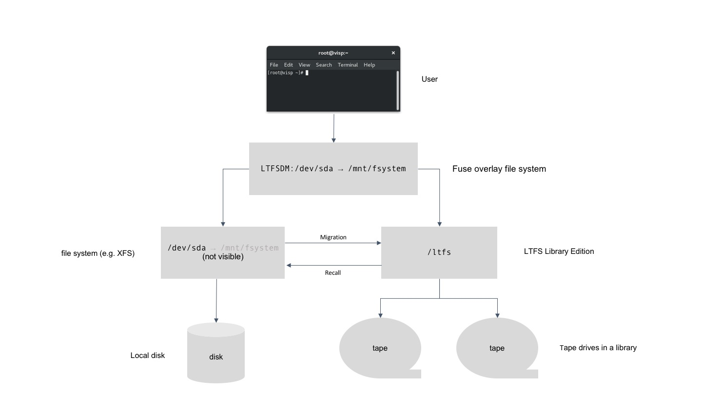

# LTFS Data Management

## Overview

With LTFS Data Management it is possible to add tape within a storage hierarchy
to disk. This is possible for Linux file system types that are compliant to the
POSIX standard. If file is migrated from disk to tape data is removed from the
disk file system and stored on tape. By using a Fuse overlay file system on top
of the original disk file system, the original files name space and the original
file sizes are exposed to applications. Accessing the file using read, write, or
truncate system calls will trigger a recall to transfer back the data to disk.
The corresponding system calls are blocked until the whole data is transferred.



## Prerequisites

Because of other dependencies LTFS Data Management only is possible to operate
at the following operating system:

- Red Hat Enterprise Linux Server release 7.X

To build and run the code there are dependencies on other software. The
following software needs to be installed prior to build and run the LTFS Data
Management code:

- non RHEL 7 software:
  - IBM Tape Device Driver at:
    [Fix Central](https://www-945.ibm.com/support/fixcentral/swg/selectFixes?parent=ibm~ST~Tapedevicedriversandsoftware&product=ibm/Storage_Tape/Tape+device+drivers&release=1.0&platform=Linux&function=all&source=fc).
    Follow the documentation of this software for installation.
  - Spectrum Archive Library Edition version 2.4.0.X available at:
    [Fix Central](https://www-945.ibm.com/support/fixcentral/swg/selectFixes?parent=Tape%20drivers%20and%20software&product=ibm/Storage_Tape/LTFS+Library+Edition+(LE)&release=2.4&platform=All&function=all).
    This software will be installed in two steps. Follow the installation instructions specified within its documentation.
- RHEL 7 packages:
  - protobuf
  - protobuf-compiler
  - protobuf-devel
  - sqlite
  - sqlite-devel
  - fuse
  - fuse-devel
  - libuuid
  - libuuid-devel
  - libmount
  - libmount-devel
  - libxml2
  - libxml2-devel
  - boost-system
  - boost-thread
  - boost-system
  - boost-devel

## Build

To compile the code the GCC C++ compiler is required version 4.8.5 or higher
that supports the C++11 standard. If all prerequisite software is installed and
the code is extracted to a directory like the following:

```
<path to code>/LTFS-Data-Management
```

change to that directory and run the make command. The resulting executables are
located within the

```
<path to code>/LTFS-Data-Management/bin
```

directory.

## Design documentation

The documentation is include within the source code in a Doxygen format. It
has to be compiled after the code has been built. The doxygen RHEL 7 software
package has to be installed prior to compile the documentation. The compilation
happens by executing the doxygen command within the

```
<path to code>/LTFS-Data-Management
```

directory. Error messages can be ignored. To read the documentation use a
browser and access the

```
<path to code>/LTFS-Data-Management/html/index.html
```

file.

A copy of the documentation is available. It might not correspond to the current code level:

[LTFS Data Management documentation](https://github.com/IBM/LTFS-Data-Management/docs/LTFS_Data_Management.pdf)

## Setting up the environment

To run the code the following shell variables need to be extended by the
following:

| variable | extension     |
| :------------- | :------------- |
| PATH | ```<path to code>/LTFS-Data-Management/bin``` |
| LD_LIBRARY_PATH | ```/usr/local/lib:/opt/IBM/ltfs/lib64:<path to code>/LTFS-Data-Management/bin``` |

## Starting the software

Prior to starting LTFS Data Management, Spectrum Archive Library Edition needs
to be started. A directory needs to be created as a mount point for LTFS. The
name of this directory can be freely chosen. If e.g. the directory name is
"/ltfs" and the corresponding IBM changer device name is "/dev/IBMchanger0"
(look at the documentation for the IBM Tape Device drive - a prerequisite to the
Spectrum Archive software -  for more information), the Spectrum Archive
software needs to be started with the following options:

```
/opt/IBM/ltfs/bin/ltfs /ltfs -o changer_devname=/dev/IBMchanger0 -o sync_type=unmount -o manual_mount_mode
```

After Spectrum Archive Library Edition is running LTFS Data Management can be
started in the following way:

```
ltfsdm start
```

## Contact information

Martin Petermann (MAP@zurich.ibm.com)
